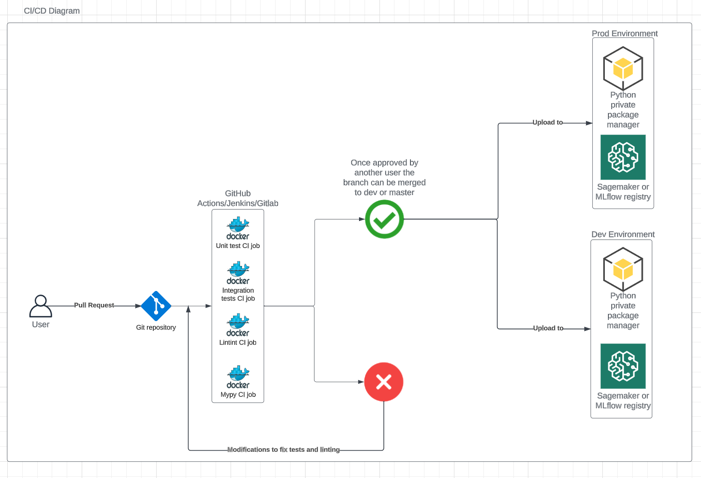
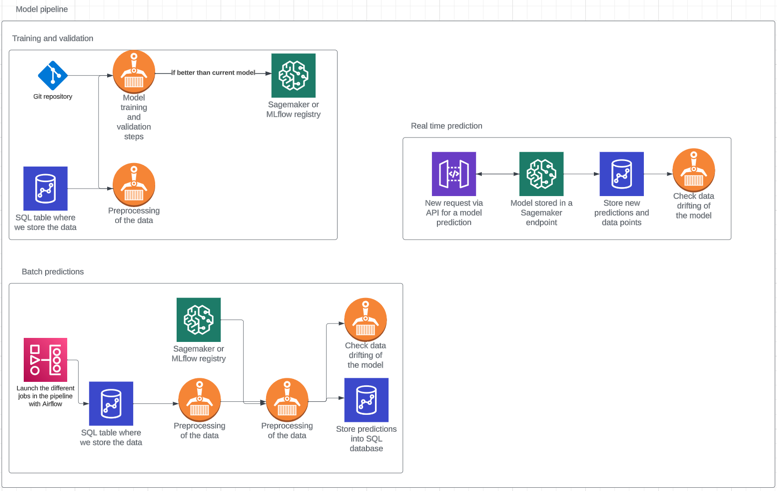

# Task 3 - CICD deployment plan
Design a CI/CD and deployment plan to serve the final model in a cloud based
production environment. This plan should include MLOps tools and KPIs
monitoring and we don't expect you to implement any code here.

I'm going to split this task into several steps that we will need to address before completing the whole
deployment of the model. As well as calling out two possible scenarios for the model deployment, one will be predicting in batches
supposing that the data does not come in real time and we do the predictions on a schedule basis. The other will be supposing that the data
does come in real time.

### CI/CD in Git
The first step will be to implement CICD in github or other git repository. We want to check the quality of our code every time we do a commit to the repository,
checking for tests, linting and typing.
Once we create a pull request and it's approved and passes all the tests, we want to deploy our package and model, so that it can be used from our pipelines to train the model
and predict new data. This process of packaging the repository can also be done from the CICD steps of our election, we are going to do a summary of all the steps, below:
When doing a commit to the repository:
- Unit tests: This will run a pytest command with the unit tests declared in the repository.
- Integration tests: If apply, we will run end to end tests using test data, to check that the end result is working as expected
- Linting: This step will check for linting in our project using `black` and `pydocstyle`.
- Typing: Optional step in which we can add `mypy` to check for the typing of our project, it can be really useful to discover errors and to document the code further.

When merging a branch:
- Package the repository: We will create a python package from the repository and store it in a private repository manager (like nexus), tagging the branch and version, to either development or stable version.
- Deploy the model to a model registry: If  applies, we could launch a training job to train and save the model to the model registry (Sagemaker or MLflow) so that it's available for predicting
  - This step will also have a dev and prod environment, using the dev environment to test new things in the model
  - And the prod environment to just release stable versions and retrain the model

We can check the summary of the items listed above in the following diagram:

### Training, prediction and deployment
Once that we have created the CICD steps for git, we are ready to put the model into deployment or to check how it will be used for two scenarios,
batch prediction and real time prediction. I will do a quick summary of the technologies and steps that will be needed for both of the approaches
and how can we measure that the model is not drifting and performing correctly. After both of the description I will include a simple diagram showcasing
what I've talked about.

#### Model training
The training of the model needs to be refreshed from time to time due to the nature of the problem, when new images and new seasons of clothes
start coming to the model, it will impact our predictions, causing a degeneration of the model. This can be solved by retraining the model with new data.
We also need to consider that if an update to the structure or to the features of the model has been uploaded to the code, this will mean that a new training process will come into play.
Using all the data available (or the one configured to) with validation steps to prove that we are putting a better model into production/development to what we had before.
Once the model is trained, we can save that model into the MLflow/Sagemaker/Model registry in order to use it for further predictions.

#### Model for batch predictions
One way to implement this problem will be on a batch data way, supposing that the data feed comes from time to time, we could
schedule the predictions via Airflow jobs or another scheduler. Running a job with the latest model via a Docker image to output a batch of predictions
that are then saved into S3 or a SQL database. For this technique we could launch a job in AWS ECR that will use the trained model and output predictions.
This approach is the easier to implement as we take out the difficulties of real time data, but may not live up to the nature of the problem, depending on the time
for prediction that we are giving our stakeholders or clients.

#### Model for real time predictions
Another approach, with a bit more of a challenge will be a real time predictor, which will have the prediction returned in little time. For this
approach we also have to take into account the time that our model takes to return a prediction, which will need to be as little as possible.
A way of implementing this will be via API, running our latest model in a docker container which can be contacted via API request (we could build this with Flask or Django) and 
will return a prediction based on some input data. We could also use AWS Sagemaker to push our model to a prediction endpoint.
Another inconvenient is that we may need to preprocess the data on the go to match the input data format of the model, which will add time and complexity to the solution.

#### Data drifting and KPIs
As well as tracking the general performance of the model with the selected metric for multi class classification (ROC curve, Accuracy, confusion matrix), every time we are predicting and we have some
labelled examples, to check that the model is performing as expected. We need to track the data drifting of the model, one way can be checking the percentage of classes that is outputting, to see if there has been
a change in the class balance. We could also check the distribution of probabilities by class compared to the validation, to see if there has been a change there as well.
Most importantly is to introduce the model little by little, with AB testing and understanding the predictions that is outputting with labelled examples at first.

#### Diagram for both approaches
I have made a simple diagram showcasing the flow of the training pipeline as well as the two scenarios discussed above.
